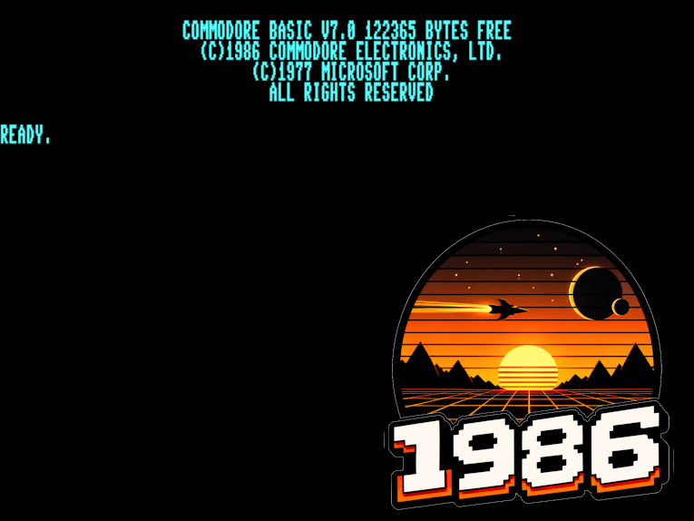
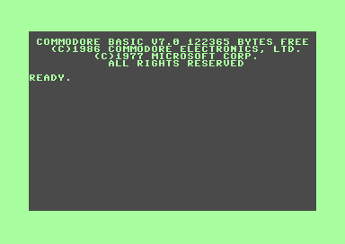
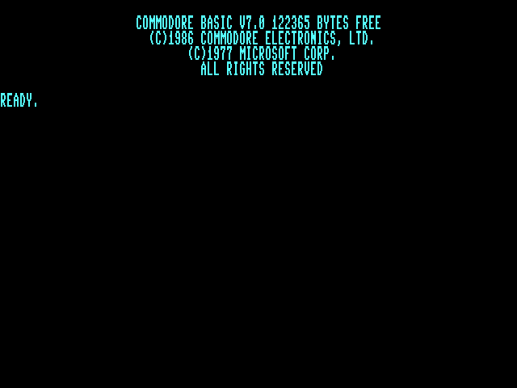
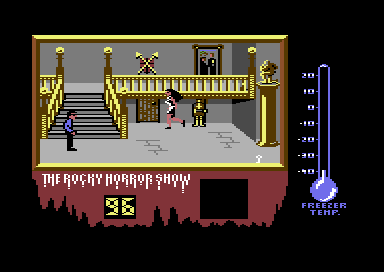
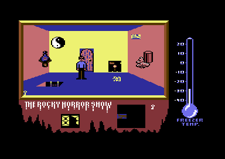
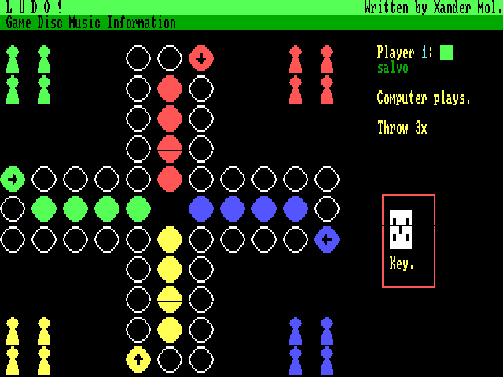

# 1986 — Commodore C128DCR emulator



1986 is an open-source, work-in-progress Commodore C128DCR emulator written
in C with an SDL3 desktop interface. It treats the C128 as a platform in its
own right: native 40-column VIC-IIe software, 80-column VDC software, and
Z80-based CP/M are all first-class targets.

The emulator currently boots Commodore BASIC 7.0 to `READY.`, boots CP/M Plus
to its `A>` prompt, runs native C128 software, and provides both fast virtual
disk access and an experimental ROM-backed 1571CR path.

## Highlights

- MOS 8502 at 1/2 MHz and Z80 at 2 MHz, with MMU-controlled CPU arbitration.
- VIC-IIe text, bitmap, sprites and raster effects; VDC text and 640x200 bitmap
  output with 16/64 KiB video RAM selection.
- Three-voice 8580 SID audio, CIA timers/interrupts, keyboard, joysticks, and
  1351 mouse input.
- D64, D71 and D81 images, standalone PRG loading, two IEC units, and atomic
  image write-back through the fast virtual drive.
- Experimental ROM-backed 1571CR emulation with line-level IEC, D64/D71 GCR
  reads and writes, per-drive activity LEDs, and audio/visual monitors.
- Native C128 cartridges, raw function ROMs, the U36 internal ROM socket, and
  TAP/T64 cassette support.
- Unified or separate VIC/VDC windows, persistent configuration, screenshots,
  GIF capture, an interactive monitor, and a compact options overlay.

See [current status and limitations](docs/STATUS.md) for the detailed hardware
matrix and [disk and drive architecture](docs/DRIVES.md) for the distinction
between virtual and ROM-backed drives.

## C128-first scope

1986 is not intended to become a general-purpose C64 emulator. A disabled-by-
default **C64 Test Mode** exposes the C128's real C64 personality only as a
development aid for validating shared hardware and C128-enhanced programs that
start in C64 mode. Native C128 and CP/M operation remain the product focus.

## Quick start

1986 does **not** distribute Commodore machine or drive ROMs. Obtain compatible
images from a source you are authorized to use, then place them in `roms/` or
select their directory with `--rom`. Required filenames are documented in
[roms/README](roms/README).

On Fedora:

```bash
sudo dnf install gcc make autoconf automake pkgconf-pkg-config sdl3-devel
autoreconf -iv
./configure
make -j"$(nproc)"
./1986
```

Use `./1986 --disk IMAGE.d64` to attach a disk at launch. Run the tests with:

```bash
make -C tests check
```

See [INSTALL.md](INSTALL.md) for other platforms and [USAGE.md](USAGE.md) for
media, configuration, ROM layout, and command-line options.

## Documentation

| Document | Contents |
|----------|----------|
| [Status](docs/STATUS.md) | Implemented hardware, C128/C64 scope, and known limitations |
| [Usage](USAGE.md) | Configuration, media, CP/M, cartridges, tape, mouse, and disk writes |
| [Controls](CONTROLS.md) | Host keys, C128 keyboard mappings, and overlay controls |
| [Drives](docs/DRIVES.md) | Fast virtual drive and experimental 1571CR architecture |
| [Z80/CP/M](docs/Z80-CPM.md) | Reset BIOS, shared-RAM trampoline, CPU handoff, and timing invariants |
| [Development](Development.md) | Source layout, emulation design, diagnostics, and testing |
| [Roadmap](ROADMAP.md) | Completed milestones and remaining work |
| [Installation](INSTALL.md) | Source builds and packaged platforms |

## Screenshots

<table>
  <tr>
    <td><br>VIC-IIe 40-column BASIC</td>
    <td><br>VDC 80-column BASIC</td>
  </tr>
  <tr>
    <td><br>The Rocky Horror Show</td>
    <td><br>The Rocky Horror Show</td>
  </tr>
  <tr>
    <td colspan="2"><br>LUDO on the VDC</td>
  </tr>
</table>

## Releases

Tagged releases build Fedora RPM, Debian DEB, Windows portable ZIP, macOS app
bundles for Apple Silicon and Intel, and a Linux Flatpak bundle. ROM images are
never included.

## Project family

1986 follows the architecture and interface conventions of its sibling
projects:

| Repo | Machine |
|------|---------|
| 1983 | MSX (Z80) |
| 1984 | Amstrad CPC (Z80) |
| 1985 | Amstrad PCW (Z80) |
| 1986 | **Commodore C128DCR (8502 + Z80)** |

The name also marks 1986 as the year its author received his first computer,
a Commodore C128, at age 13.

## Acknowledgments

1986 owes a great deal to [VICE, the Versatile Commodore Emulator](https://vice-emu.sourceforge.io/)
and its contributors. The 8502/6510 core is adapted from VICE, and VICE's C128
hardware emulation is an important reference throughout the project. Ported
source files retain their original copyright and license notices under
`src/vice/`. Thank you to the VICE team for making this work available.
